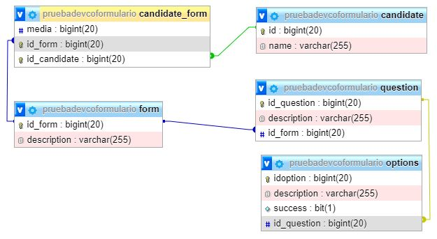
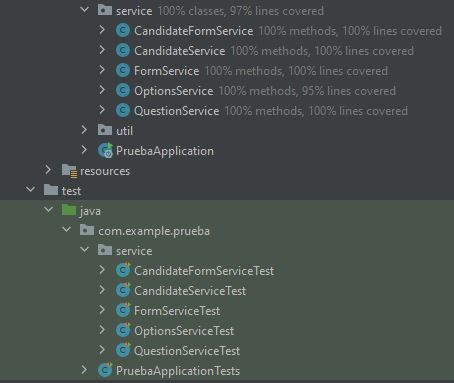
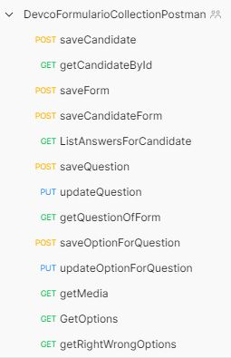
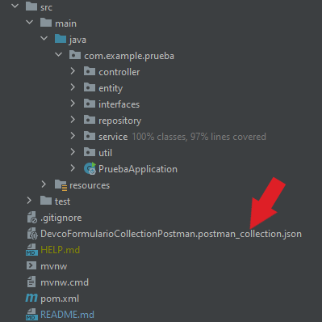

# retoDevcoFormulario

<div style="text-align: justify "> El presente proyecto es una API para el manejo de formularios con preguntas
y sus respectivas opciones de respuesta, la puntuación se calcula con base en el número de 
respuestas correctas e incorrectas. </div>

## Modelo de bases de datos 📄



### Tecnologías 🚀

* Spring Boot
* MySQL 8.0.25
* XAMPP
* Postman

### Requerimientos para desarrollo 📋

* [Maven](https://maven.apache.org/) - Manejador de dependencias

- Java v11

### Pruebas unitarias ⌨️

Las pruebas unitarias estan hechas con Mockito y cubren los servicios del API
<br/>


## Acerca del API

A continuación, se muestran **algunos** de los endpoints a los que se puede llamar:

### Endpoints

```
localhost:8080/api/candidate
localhost:8080/api/form
localhost:8080/api/candidateForm
localhost:8080/api/question
localhost:8080/api/options
```
Además se adjunta la colección de postman con las siguientes peticiones:
<br/>

<br/>


## Despliegue 📦

El proyecto esta desplegado en heroku, y se puede consumir con el siguiente [link](https://maven.apache.org/)

## Autores ✒️

* **Dylann Steven** - *dguarnizoserrato@gmail.com* -
