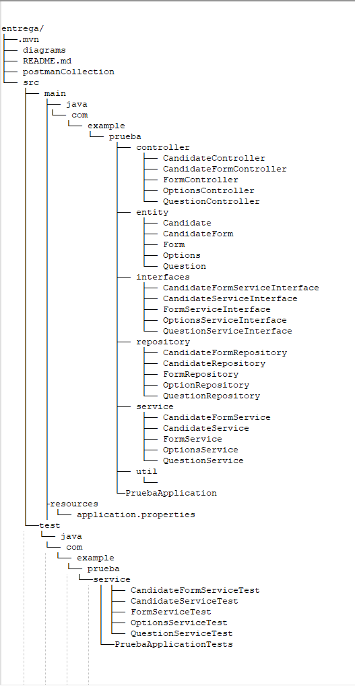

# retoDevcoFormulario

<div style="text-align: justify "> El presente proyecto es una API para el manejo de formularios con preguntas
y sus respectivas opciones de respuesta, la puntuación se calcula con base en el número de 
respuestas correctas e incorrectas. </div>

## Modelo de bases de datos 📄 


####Nota: 
**<div style="text-align: justify ">Antes de ejecutar el proyecto se debe de ejecutar el siguiente comando en MySQL, 
ya con este, el proyecto se encargara de crear las tablas automaticamente, es importante ejecutar tal cual la instrucción
que se muestra a continuación</div>**  
```
create database pruebadevcoformulario
```

## Diagrama de arquitectura


### Tecnologías 🚀 

* Spring Boot
* MySQL 8.0.25
* XAMPP
* Postman

### Requerimientos para desarrollo 📋 

* [Maven](https://maven.apache.org/) - Manejador de dependencias

- Java v11

### Pruebas unitarias ⌨️

Las pruebas unitarias estan hechas con Mockito y cubren los servicios del API
<br/>


## Acerca del API

A continuación, se muestran **algunos** de los endpoints a los que se puede llamar:

### Endpoints

```
localhost:8080/api/candidate
localhost:8080/api/form
localhost:8080/api/candidateForm
localhost:8080/api/question
localhost:8080/api/options
```
Además se adjunta la colección de postman con las siguientes peticiones:
<br/>

<br/>


## Autores ✒️

* **Dylann Steven** - *dguarnizoserrato@gmail.com* -
